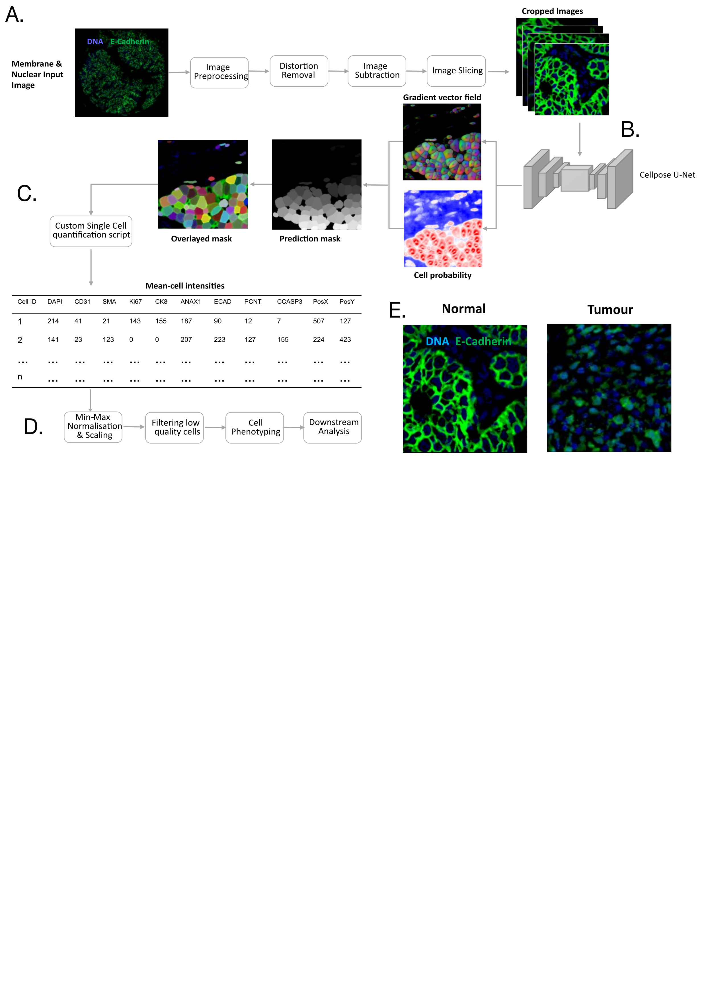
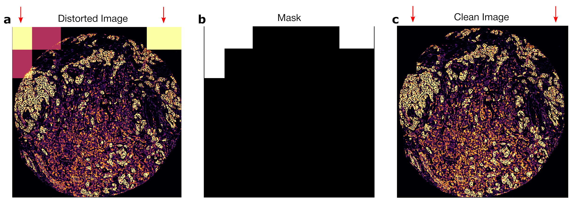
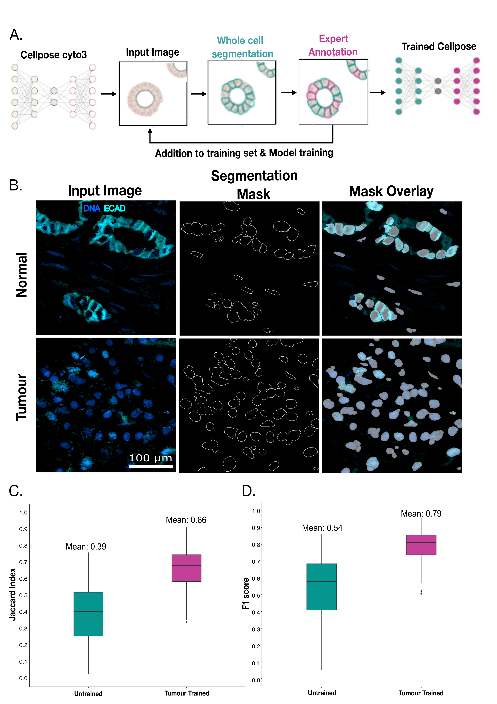
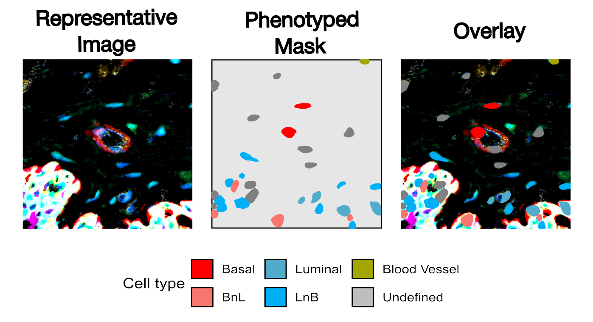

# Investigating human breast tissue cohort heterogeneity and its association with Annexin A1 through multiplex imaging and deep learning

This repository contains code and workflows developed during my MRes dissertation project, which focuses on analysing ANAX1 expression, cellular heterogeneity, cell phenotyping, and spatial organisation in breast cancer tissue using advanced computational methods.  
## Workflow Overview  

Below is a high-level overview of the workflow used in this project, from image preprocessing to spatial analysis:  

  

## Directory Structure  

### 1. Image Preprocessing and Filtering  
This folder contains scripts for preprocessing raw IHC images and preparing them for downstream single-cell analysis.  

- **`01_Distortion_Removal.ipynb`**: Removes visual distortions in cohort images using a shape detection algorithm. 

Example of distortion removal:  
     

- **`02_Split_Images.ipynb`**: Splits large core images into smaller 512x512 regions, optimal for Cellpose training and segmentation.  

### 2. Training  
Contains workflows for training the Cellpose segmentation model and evaluating its performance.  

- **`01_Train_Cellpose.ipynb`**: Trains the Cellpose model using a human-in-the-loop approach to improve segmentation accuracy.  
- **`02_Calculate_Accuracy.ipynb`**: Calculates model accuracy using IoU and Dice metrics.  
- **`03_Visualise_Accuacy.r`**: Uses ggplot2 to visualise segmentation accuracy across tissue types.  
- **`04_Segment_Images.ipynb`**: Segments IHC images into single-cell regions using the trained Cellpose model.  

  

### 3. Cellpose-Quantification  
This code is hosted in a separate repository:  
[**GitHub - Cellpose-Quantification**](https://github.com/milesbailey121/cellpose-quantification)  
The repository provides CLI tools for high-throughput cell quantification based on Cellpose outputs generating single-cell data in a csv format.  

### 4. Cell and Patient Preprocessing  
Scripts to process and summarise single-cell phenotypes and patient cohort data.  

- **`01_filter_&_phenotype.R`**: Filters data and assigns phenotypes to segmented cells.  

 Example of a phenotyped image:  
    

- **`02_plotting_patients.R`**: Generates visual summaries of patient-level marker expression and phenotypic distributions.  

### 5. Cell Visualisation  
Visualises marker expression and cell phenotypes across the dataset.  

- **`01_marker_&_celltype.R`**: Creates plots to highlight marker expression and cell-type distributions.  
- **`03_heatmap_cohort.R`**: Produces cohort-wide heatmaps to display trends in marker expression and phenotypes.  

### 6. Spatial Analysis  
Analyses spatial relationships and cell-cell interactions within the tissue microenvironment.  

- **`01_Spatial_Analysis.R`**: Identifies spatial patterns of cell organisation.  
- **`02_Test_Cell-Cell_Interactions.R`**: Tests statistical relationships between cell types and their spatial proximities.  

## Project Highlights  
1. **Cellpose Training**: Improved segmentation accuracy by leveraging human-in-the-loop annotations.  
2. **Cellpose Quantification**: Developed a CLI tool to automate high-throughput cell quantification.  
3. **Heterogeneity Analysis**: Showed significant variability in ANAX1 expression across patients, phenotypes, and subtypes.  
4. **Spatial Analysis**: Uncovered epithelial structure loss and altered cell-cell interactions in tumorigenesis.  
