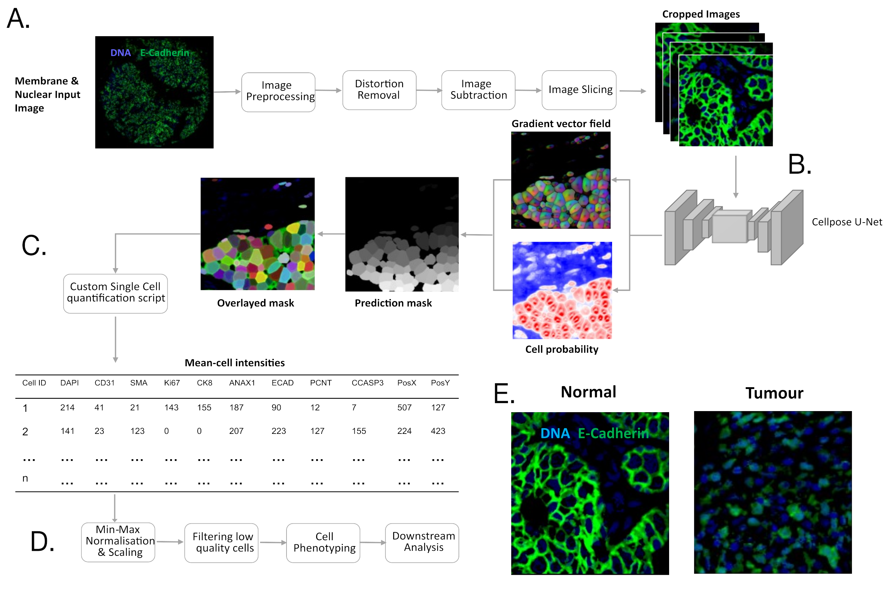
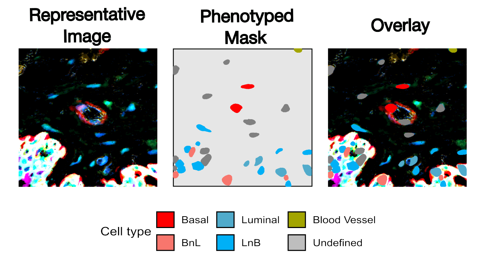

# Investigating human breast tissue cohort heterogeneity and its association with Annexin A1 through multiplex imaging and deep learning

This repository contains code and workflows developed during my MRes dissertation project, which focuses on analysing ANAX1 expression, cellular heterogeneity, cell phenotyping, and spatial organisation in breast cancer tissue using advanced computational methods.  
## Workflow Overview  

Below is a high-level overview of the workflow used in this project, from image preprocessing to spatial analysis:  

  

*Figure 1. Overall workflow for segmentation and single cell quantification. (A) Preprocessing steps were taken to process TIFF images within our dataset. (B) Cellpose CNN segmentation model was employed to segmented sliced images generating segmentation masks through combination of Gradient vector fields generated by watershed algorithm and cell probability. (C) Single cell quantification was performed to generate csv files for each image that allow for quantification at a single cell level. (D) Post-processing steps taken to allow for investigation. (E) Representative images displaying the challenges of cell segmentation with such a diverse staining within our cohort.*  

## Directory Structure  

### 1. Image Preprocessing and Filtering  
This folder contains scripts for preprocessing raw IHC images and preparing them for downstream single-cell analysis.  

- **`01_Distortion_Removal.ipynb`**: Removes visual distortions in cohort images using a shape detection algorithm. 

Example of distortion removal:  
     
*Figure 2. Image distortion removal through shape detection. (a) Sum projection of a representative distorted image. (b) Shape bounding box mask generated across all channels. This cumulative mask was applied to the original image allowing for removal of distortion. (c) Sum projection representation of TIFF image with distortion removed.*

- **`02_Split_Images.ipynb`**: Splits large core images into smaller 512x512 regions, optimal for Cellpose training and segmentation.  

### 2. Training  
Contains workflows for training the Cellpose segmentation model and evaluating its performance.  

- **`01_Train_Cellpose.ipynb`**: Trains the Cellpose model using a human-in-the-loop approach to improve segmentation accuracy.  
- **`02_Calculate_Accuracy.ipynb`**: Calculates model accuracy using IoU and Dice metrics.  
- **`03_Visualise_Accuacy.r`**: Uses ggplot2 to visualise segmentation accuracy across tissue types.  
- **`04_Segment_Images.ipynb`**: Segments IHC images into single-cell regions using the trained Cellpose model.  

  
*Figure 3. Cellpose model training. Using the Human-in-the-loop methodology, a Cellpose model was trained on 512x512 pixel tumour image data (n = 248). (B) Characteristic cohort images displaying DNA and E-cadherin staining and predicted masks generated from trained cellpose. Quantified accuracy scores of the trained Cellpose models were calculated using the Jaccard index(C) and F1 score(D) using a test set of 98 representative tumour 512x512 images. Untrained cellpose is represented in turquoise, and trained is represented by pink.*
### 3. Cellpose-Quantification  
This code is hosted in a separate repository:  
[**GitHub - Cellpose-Quantification**](https://github.com/milesbailey121/cellpose-quantification)  
The repository provides CLI tools for high-throughput cell quantification based on Cellpose outputs generating single-cell data in a csv format.  

### 4. Cell and Patient Preprocessing  
Scripts to process and summarise single-cell phenotypes and patient cohort data.  

- **`01_filter_&_phenotype.R`**: Filters data and assigns phenotypes to segmented cells.  

 Example of a phenotyped image:  
    
*Figure 4. Representative mask overlayed with phenotyped cells. Cells were classified by their marker expression of CK8, ECAD, SMA, and CD31.*
- **`02_plotting_patients.R`**: Generates visual summaries of patient-level marker expression and phenotypic distributions.  

### 5. Cell Visualisation  
Visualises marker expression and cell phenotypes across the dataset.  

- **`01_marker_&_celltype.R`**: Creates plots to highlight marker expression and cell-type distributions.  
- **`03_heatmap_cohort.R`**: Produces cohort-wide heatmaps to display trends in marker expression and phenotypes.  

### 6. Spatial Analysis  
Analyses spatial relationships and cell-cell interactions within the tissue microenvironment.  

- **`01_Spatial_Analysis.R`**: Identifies spatial patterns of cell organisation.  
- **`02_Test_Cell-Cell_Interactions.R`**: Tests statistical relationships between cell types and their spatial proximities.  

## Project Highlights  
1. **Cellpose Training**: Improved segmentation accuracy by leveraging human-in-the-loop annotations.  
2. **Cellpose Quantification**: Developed a CLI tool to automate high-throughput cell quantification.  
3. **Heterogeneity Analysis**: Showed significant variability in ANAX1 expression across patients, phenotypes, and subtypes.  
4. **Spatial Analysis**: Uncovered epithelial structure loss and altered cell-cell interactions in tumorigenesis.  
